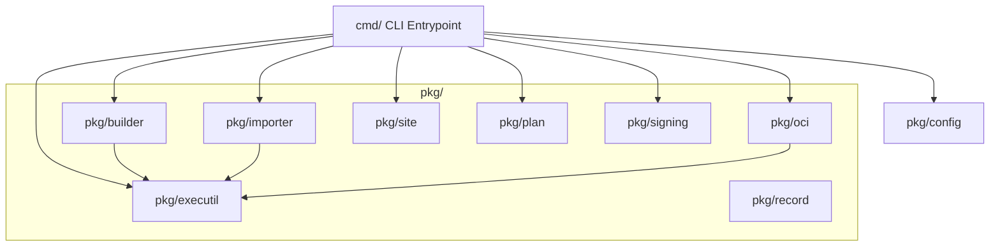

# AetherPak CLI Architecture

This document describes the architectural design, component interactions, interface abstractions, and command boundaries of the AetherPak CLI toolchain.

---

## 1. Design Overview

AetherPak CLI is a foundation-first Go toolchain designed to compile, lint, package, sign, push (to OCI registries), and publish (to static hosting/GitHub Pages) Flatpak applications.

The application architecture is structured to separate the **Command-Line Interface Boundary** (`cmd/`) from the **Core Business Logic** (`pkg/`). This decoupling ensures that the core features remain testable, reusable, and free from hard OS-level side effects (like direct `os.Exit` calls).



---

## 2. Plumbing vs. Porcelain

Following the Git design philosophy, the CLI divides its commands into **Porcelain** (user-facing, high-level workflows) and **Plumbing** (low-level, modular utilities).

### Porcelain (High-Level Workflows)
Porcelain commands orchestrate multiple plumbing modules to provide a seamless user experience.

* **`aetherpak build`**: Compiles flatpak manifests. It automatically:
  1. Installs/resolves `flatpak-builder-lint`.
  2. Runs pre-build linting on the manifest.
  3. Executes `flatpak-builder` with CCache/state management.
  4. Runs post-build linting on the generated repository.
* **`aetherpak import`**: Downloads and imports an external `.flatpak` bundle. It handles:
  1. Downloading/verifying SHA-256 checksums.
  2. Importing the bundle into a scratch repository.
  3. Rebinding the branch commit ref to match the target release channel.
* **`aetherpak publish`**: Aggregates records, reconciles remote OCI images, signs assets, and generates static pages.
* **`aetherpak release`**: A comprehensive, single-app workflow that runs build, push-oci, and publish steps in sequence.

### Plumbing (Low-Level Utilities)
Plumbing commands are designed to be run programmatically (e.g., inside CI matrix runners or custom scripts) and perform single, deterministic tasks.

* **`aetherpak push-oci`**: Packages a local OSTree repository ref into an OCI container image and pushes it to a registry.
* **`aetherpak build-site`**: Reads a tree of cell execution records, fetches the active landing page index, merges new records, and writes static Pages assets.
* **`aetherpak plan`**: Analyzes repository git differences since a base commit and expands the `aetherpak.yaml` configuration into a parallelizable build/publish matrix.
* **`aetherpak inspect-repo`**: Resolves information (commits, metadata, refs) directly from a local OSTree repository.

---

## 3. Core Interface Abstractions

To achieve high unit test coverage without invoking real shell binaries (like `flatpak` or `ostree`), the CLI abstracts command execution and configuration injection.

### Testable Subprocess Execution (`pkg/executil`)
Instead of calling the standard library's `exec.Command` directly, all subprocess execution is routed through the `Executor` and `Command` interfaces:

```go
type Command interface {
	Run() error
	Start() error
	Wait() error
	StdoutPipe() (io.ReadCloser, error)
	StderrPipe() (io.ReadCloser, error)
	SetEnv(env []string)
	SetStdout(w io.Writer)
	SetStderr(w io.Writer)
}

type Executor interface {
	Command(name string, arg ...string) Command
	LookPath(file string) (string, error)
}
```

* **`OSExecutor`**: Production implementation wrapping Go's `os/exec`.
* **`MockExecutor` / `MockCommand`**: Mock implementations configured with hooks (`OnCommand`) and predefined stdout/stderr outputs to assert command arguments and simulate execution results during tests.

### Log Prefix Streaming
The `StreamWithPrefix` function reads output from subprocess pipes line-by-line and writes them with formatted prefixes (e.g., `flatpak-builder |`) to standard output. It uses a chunk-based loop:
1. It reads bytes until `\n` using `bufio.Reader.ReadBytes`.
2. It accumulates partial lines when encountering buffer-boundary errors (`bufio.ErrBufferFull`).
3. It flushes any remaining trailing bytes on EOF/error.
4. It bypasses prepending a leading space when the prefix is empty (`""`).

---

## 4. Package Architecture & Responsibilities

### `pkg/config`
* Responsible for parsing, normalizing, and validating the `aetherpak.yaml` workspace configuration.
* Asserts structural requirements (e.g., ensuring an app has either a manifest or a bundle URL, checking that app IDs follow reverse-DNS patterns, and preventing path-traversals).
* Supports `builder_args` list parameters at both the global `defaults` level and the per-app level (facilitating inheritance of build arguments).

### `pkg/builder`
* Wraps the `flatpak-builder` runtime compilation workflow.
* Launches asynchronous goroutines to stream build output.
* Accepts extra passthrough arguments (`BuilderArgs`) from configuration and CLI overrides to customize the execution of the compilation sandbox.
* Explicitly cleans up/closes stdout and stderr pipe file descriptors after streaming, ensuring no leaks in long-running processes.

### `pkg/importer`
* Implements a robust 5-step import pipeline:
  1. **Download**: Fetches external bundles and validates SHA-256 integrity.
  2. **Scratch OSTree Init**: Initializes a temporary OSTree archive repository.
  3. **Build Import**: Invokes `flatpak build-import-bundle` to import the `.flatpak` file.
  4. **Ref Resolution**: Lists refs in the scratch repository to resolve the bundle's application ID.
  5. **Branch Rebinding**: Invokes `flatpak build-commit-from` to copy the ref into the target repository while re-mapping it to the consumer-defined channel (e.g., rebinding `app/org.example.App/x86_64/master` to `app/org.example.App/x86_64/stable`).

### `pkg/oci`
* Bundles OSTree repositories into OCI images using `flatpak build-bundle`.
* Interacts with container registries using the `go-containerregistry` library.
* Generates an image manifest index and signs the manifest payload. Supports bypassing GPG signing when `no_sign` is set to `true`. When `no_sign` is `false`, it enforces that a GPG key must be provided, failing the push unless `allow_unsigned` is explicitly enabled.
* Writes a uniform execution record (`record.json`) under `<records-dir>/<app-id>-<arch>/` tracking the OCI digest, registry, and label metadata.

### `pkg/site`
* Assembles the static repository landing page.
* Fetches the current production index from the active Pages hosting to seed the update.
* Merges execution records from parallel runner cells.
* Reconciles the index by validating digest existence via registry `HEAD` checks (pruning entries only on definitive 404s).
* Generates GPG public key material (`key.asc`), signing manifests (`signing.json`), `.flatpakrepo` configurations, and one-click `.flatpakref` installer files. Bypasses key export and GPG validation checks when `no_sign` is set to `true`, and enforces GPG key existence unless `allow_unsigned` is explicitly enabled.

### `pkg/plan`
* Compares Git trees (`git diff`) since a base SHA to detect changes in manifests, directories, and configuration settings.
* Expands active configs into a parallel workflow matrix, optimizing CI resources by building only modified apps/architectures.

### `pkg/signing`
* Encapsulates GPG simple-signing helper functions.
* Manages GPG private key loading, public key ring exports, and payload signatures.

---

## 5. Command boundary and Exit Handling

The CLI implements strict error-handling safety:

1. **Decoupled Process Exiting**:
   Subcommands are defined using Cobra's `RunE` pattern. Instead of calling `os.Exit` directly inside cmd packages, subcommands return errors. This guarantees that Go's deferred functions (such as temp directory cleanup and socket closes) run completely.

2. **`CmdError` Struct**:
   A custom `CmdError` type wraps internal errors with an associated process exit code:
   ```go
   type CmdError struct {
       ExitCode int
       Err      error
   }
   ```
   * Implements `Unwrap() error` to preserve error chains.
   * `cmd.Execute()` captures this error at the boundary, prints a formatted error banner, and returns the exit code to `main.go` where `os.Exit()` is invoked.
